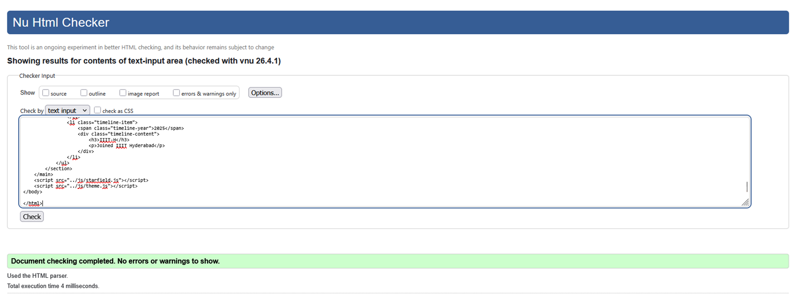
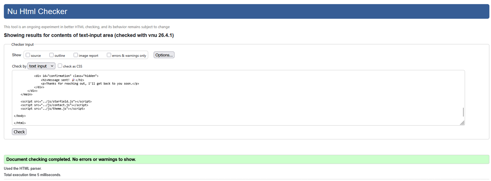
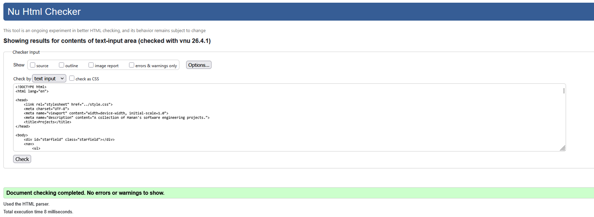
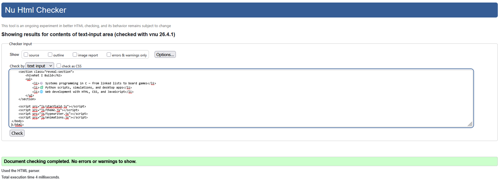
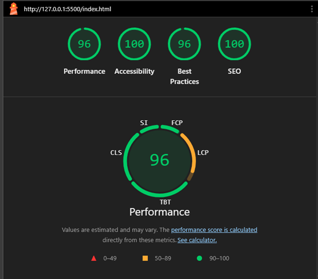
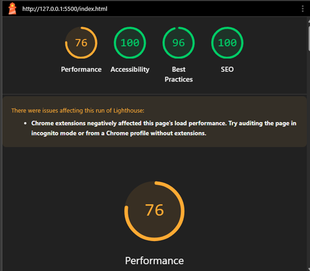
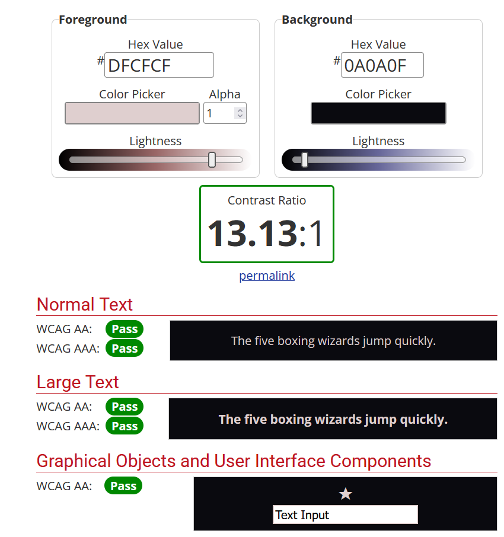
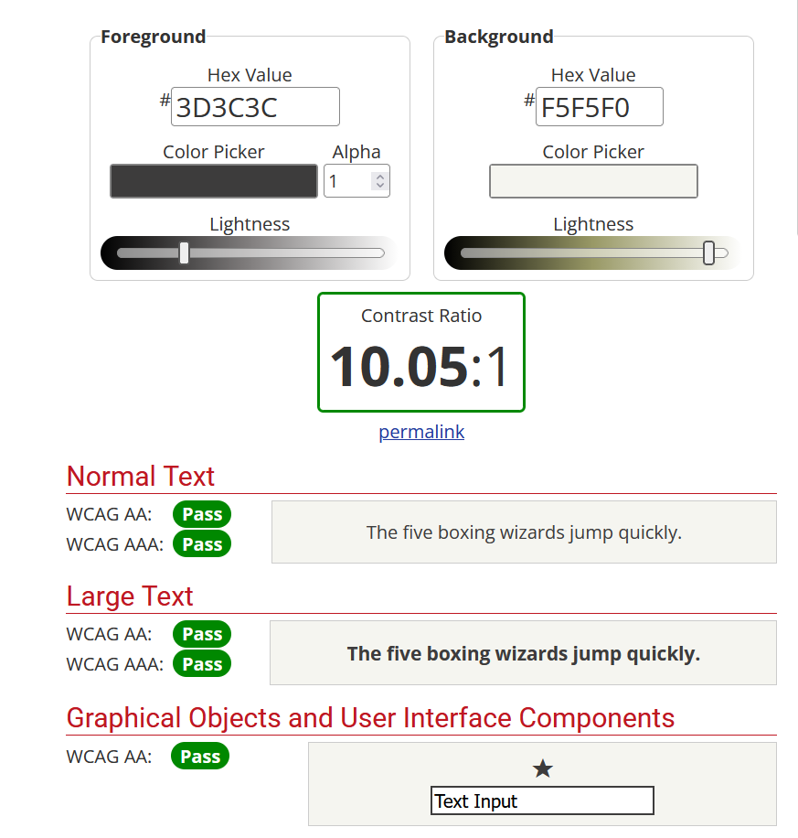

# Student Details
Name: Manan Deopurkar  
Roll Number: 2025111030

---

## Deployment

Live URL: https://researchweb.iiit.ac.in/~manan.deopurkar/html/about.html

---

# Portfolio Website - Technical Decisions

## D2: Visual Design System & Typography

**Typographic Pairing Chosen:**
- Display Font: Outfit  
- Body Font: Inter  

**Justification:**
I chose these fonts because I wanted the site to look clean and modern while still being easy to read.

- Outfit is used for headings because it looks bold and stands out clearly. It helps separate titles from the rest of the content.
- Inter is used for normal text because it is very easy to read on screens, especially for longer paragraphs like project descriptions.

This combination keeps the site simple, readable, and visually neat.

---

## D3: Motion & Animation

**Hero Entrance Sequence**
- What it communicates: The content appears step by step instead of all at once, so it is easier to read. It also helps guide the user towards the button.

---

**Scroll-Triggered Section (Intersection Observer)**
- What it communicates: Content shows up only when you scroll to it, so it grabs attention at the right time. It makes the page feel more interactive.

---

**Purposeful Micro-interaction (CTA Button & Card Hover)**
- What it communicates: The hover effect feels slightly bouncy, which makes buttons and cards feel clickable. It gives a clear signal that the user can interact with them.

---

**Reduced Motion Handling**
- What it communicates: If a user prefers less motion, animations are removed so the site is comfortable to use. The content still appears clearly without movement.

---

## D4: JavaScript Features (Group A & B)

1. **Group A: Filterable & Bookmarkable Project Index (A1)**
   - I built a filter system where users can click tags to filter projects. The selected filters are stored in the URL using the History API, so the same filtered view can be shared or revisited.

2. **Group B: Typed-Text Component (B1)**
   - I created a TypeWriter class that types and cycles through different words in the hero section. This helps show multiple areas of interest in a compact way.

---

## D5: Accessibility & ARIA Implementation

I made sure the site can be used with a keyboard and is readable by screen readers.

**ARIA usage:**

1. **Theme Toggle (`aria-label`)**
   - The button only shows an emoji, so I added a label so screen readers know what it does.

2. **Project Filter Tags (`aria-pressed`)**
   - When a filter is active, this attribute tells screen readers that the button is toggled.

3. **Project Details Toggle (`aria-expanded`)**
   - This tells whether the project description is open or closed.

4. **Typed Text (`aria-hidden`)**
   - The typing animation is hidden from screen readers, and a normal readable version is provided instead.

---

## Validation & Accessibility Evidence

### HTML Validation

### Lighthouse Audit

### WCAG Contrast (Dark Theme)

### WCAG Contrast (Light Theme)
